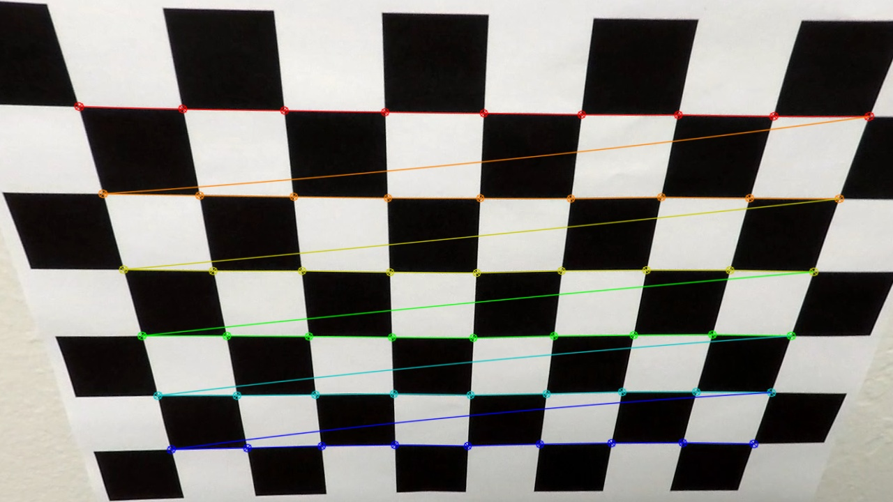
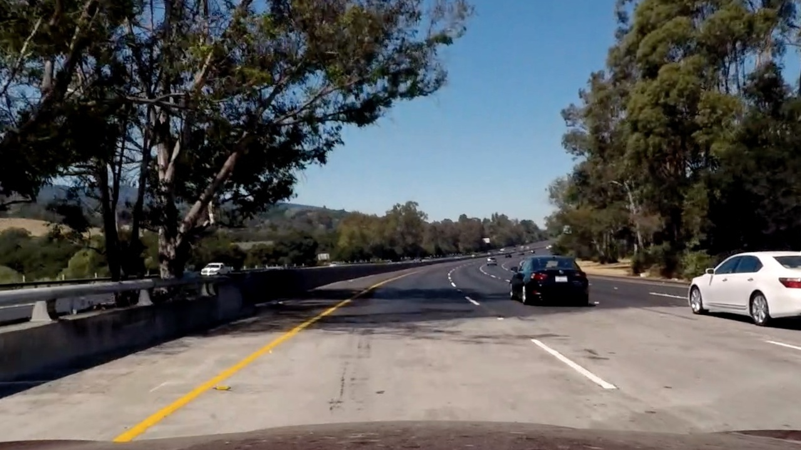
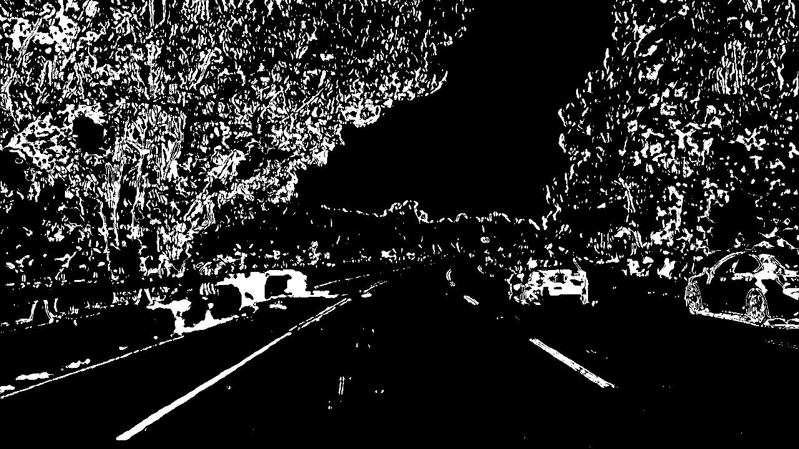
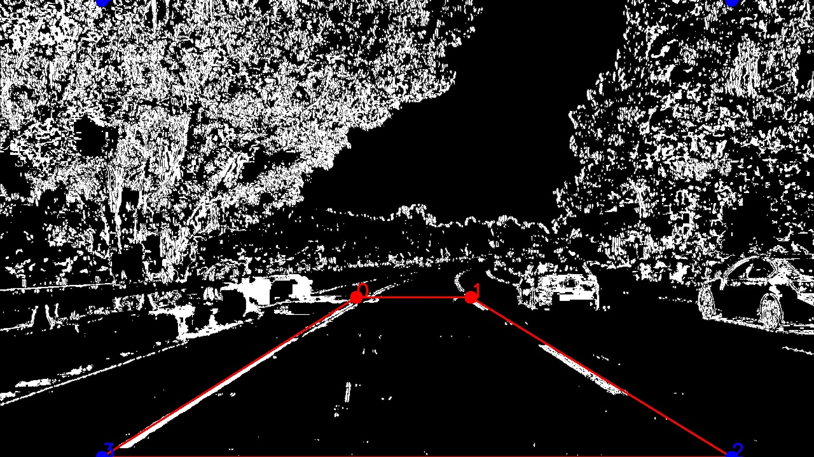
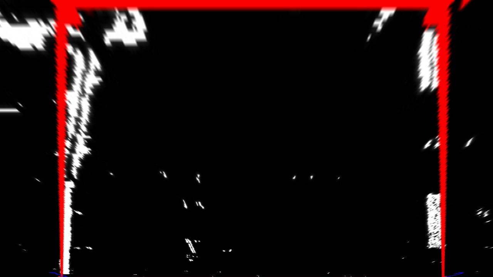

# Advanced Lane Finding Project

> Intro..

## Goal

The goals / steps of this project are the following:

* Compute the camera calibration matrix and distortion coefficients given a set of chessboard images.
* Apply a distortion correction to raw images.
* Use color transforms, gradients, etc., to create a thresholded binary image.
* Apply a perspective transform to rectify binary image ("birds-eye view").
* Detect lane pixels and fit to find the lane boundary.
* Determine the curvature of the lane and vehicle position with respect to center.
* Warp the detected lane boundaries back onto the original image.
* Output visual display of the lane boundaries and numerical estimation of lane curvature and vehicle position. 

A full project rubrick cn be found from the [project specification](https://review.udacity.com/#!/rubrics/1966/view) (when logged in to Udacity).

## Setup

This work has been created with the help of Docker in order to keep your local environment clean and for easy execution of the pipeline. When Docker is installed, running `make run` from the repo root directory will start the Docker container and run the pipeline. Output from the pipeline will end up into the `assets/output_images` directory.

The images for camera calibration are stored in the folder called `assets/camera_cal`.
The images in `assets/test_images` are for testing the pipeline on single frames.

---

## 1. Camera Calibration

### 1. Briefly state how you computed the camera matrix and distortion coefficients. Provide an example of a distortion corrected calibration image.

The code for this step is contained in the class `Undistorter` found in `src/alf/calibration/undistorter.py`.  

[TBD]

.. To compute the transformation between 3d objects in the world and 2d image points.

I start by preparing "object points", which will be the (x, y, z) coordinates of the chessboard corners in the world. Here I am assuming the chessboard is fixed on the (x, y) plane at z=0, such that the object points are the same for each calibration image.  Thus, `objp` is just a replicated array of coordinates, and `objpoints` will be appended with a copy of it every time I successfully detect all chessboard corners in a test image.  `imgpoints` will be appended with the (x, y) pixel position of each of the corners in the image plane with each successful chessboard detection.  

I then used the output `objpoints` and `imgpoints` to compute the camera calibration and distortion coefficients using the `cv2.calibrateCamera()` function.  I applied this distortion correction to the test image using the `cv2.undistort()` function and obtained this result: 
[/TBD]

| Input            |  Output |
|:-------------------------:|:-------------------------:|
| |  |

## 2. Pipeline (single images)

### 2.1 Provide an example of a distortion-corrected image

Once we have a calibrated Undistorter object as described in section 1.1. we can simply apply the undistort method on any of our test images found from `./assets/test_images` directory.

[WIP]
...to ensure that the geometrical shape of objects is represents consistently , no matter where they appear in an image.
[/WIP]

|Input            |  Output |
|:-------------------------:|:-------------------------:|
|  |  |

### 2.2 Describe how (and identify where in your code) you used color transforms, gradients or other methods to create a thresholded binary image.  Provide an example of a binary image result

With a `Thresholder` object created from its class found in `./src/alf/pipeline/thresholder.py` both color and gradient thresholds are applied to an image in the `threshols()` function. This function combines the threshold results as a binary image.

| Input            |  Output |
:-------------------------:|:-------------------------:
 |  |

## 2.3 Describe how (and identify where in your code) you performed a perspective transform and provide an example of a transformed image

The perspective transform requires the knowledge of a set of source points which then are mapped onto desired destination points. We will find them manually for now but trying to find both sets automatically seems a good usecase for reusing the results from [lane finding project]().

As example input to this step of the pipeline we use the output image of the previous stage: a binary thresholded image. 

The source and destination points are created in the `Roi` class found in `alf/common/roi.py`. 
For the source points I chose values that created a snug fit on the outsides of the lane lines when connecting them via lines. The desination points are based on the source points whereby the upper point position are changed so that the resulting polygon becomes a square. This resulted in the following source and destination points:

| Source (x, y)       | Destination (x, y)  | 
|:-------------:|:-------------:| 
| 560, 468      | 160, 0        | 
| 740, 468      | 1150, 0       |
| 1150, 720     | 1150, 720     |
| 160, 720      | 160, 720      |

I verified that my perspective transform was working as expected by drawing the `src` and `dst` points onto a test image and its warped counterpart to verify that the lines appear parallel in the warped image.

| Input                      |  Marked (example)         | Output |
|:-------------------------:|:-------------------------:|:-------------------------:|
|  |  |  |

The images contain the points and lines for illustrative purposed, they will not be drawn in the actual pipeline. It seems that the transform is succesfull as the bounding box is a rectangle and the lane lines can be considered to be perpendicular to each other and both slightly directed to the right as in the original picture.

| Perspective Transform result|
|:-------------------------:|
|  |

### 2.4. Describe how (and identify where in your code) you identified lane-line pixels and fit their positions with a polynomial?

Then I did some other stuff and fit my lane lines with a 2nd order polynomial kinda like this:

![alt text][image5]

### 2.5. Describe how (and identify where in your code) you calculated the radius of curvature of the lane and the position of the vehicle with respect to center.

I did this in lines # through # in my code in `my_other_file.py`

### 2.6. Provide an example image of your result plotted back down onto the road such that the lane area is identified clearly.

I implemented this step in lines # through # in my code in `yet_another_file.py` in the function `map_lane()`.  Here is an example of my result on a test image:

![alt text][image6]

---

## 3. Pipeline (video)

### 3.1. Provide a link to your final video output.  Your pipeline should perform reasonably well on the entire project video (wobbly lines are ok but no catastrophic failures that would cause the car to drive off the road!).

Here's a [link to my video result](./project_video.mp4)

---

## Discussion

#### 1. Briefly discuss any problems / issues you faced in your implementation of this project.  Where will your pipeline likely fail?  What could you do to make it more robust?

Here I'll talk about the approach I took, what techniques I used, what worked and why, where the pipeline might fail and how I might improve it if I were going to pursue this project further.  

- Road inclination

## Sources

* [Original project repository](https://github.com/udacity/CarND-Advanced-Lane-Lines)
