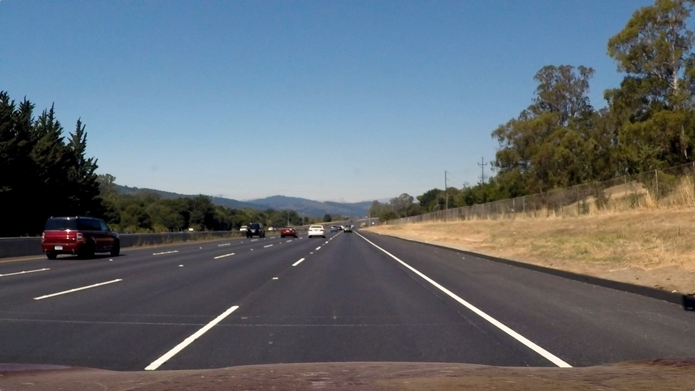
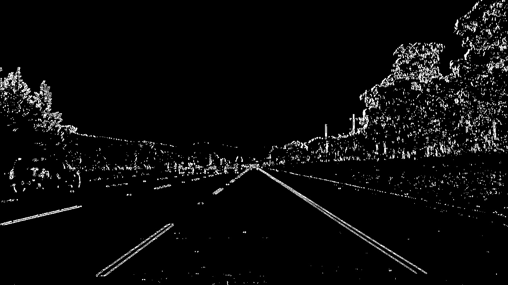
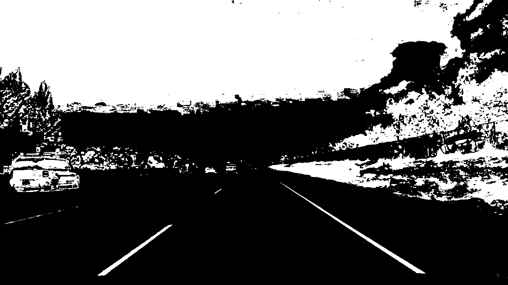
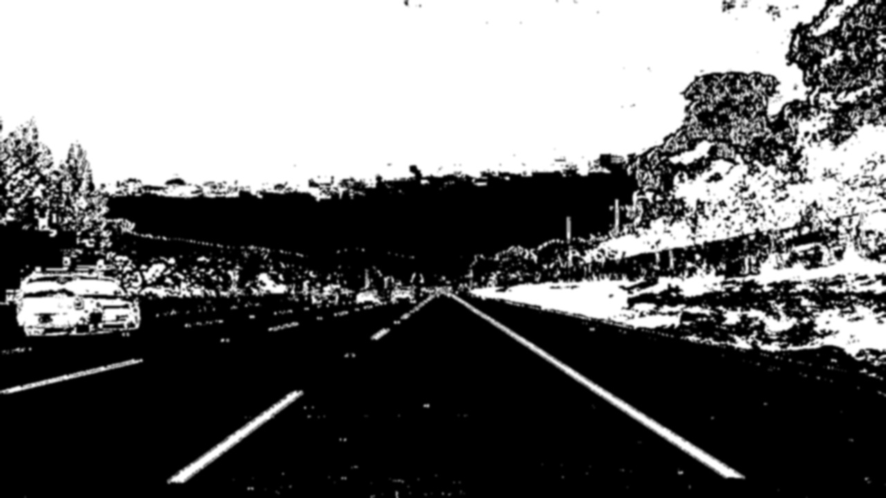

# Advanced Lane Finding Project

> Intro..

## Goal

The goals / steps of this project are the following:

* Compute the camera calibration matrix and distortion coefficients given a set of chessboard images.
* Apply a distortion correction to raw images.
* Use color transforms, gradients, etc., to create a thresholded binary image.
* Apply a perspective transform to rectify binary image ("birds-eye view").
* Detect lane pixels and fit to find the lane boundary.
* Determine the curvature of the lane and vehicle position with respect to center.
* Warp the detected lane boundaries back onto the original image.
* Output visual display of the lane boundaries and numerical estimation of lane curvature and vehicle position. 

A full project rubrick can be found from the [project specification](https://review.udacity.com/#!/rubrics/1966/view) (when logged in to Udacity).

## Setup

This work has been created with the help of Docker in order to keep your local environment clean and for easy execution of the pipeline. When Docker is installed, running `make run` from the repo root directory will start the Docker container and run the pipeline. Output from the pipeline will end up into the `assets/output_images` directory.

The images for camera calibration are stored in the folder called `assets/camera_cal`.
The images in `assets/test_images` are for testing the pipeline on single frames.

---

## 1. Camera Calibration

The code for this step is contained in the class `DistortionCorrector` found in `alf/pipeline/distortion_corrector.py`.  
Before using the DistortionCorrector it needs to be calibrated by passing a set of images to its `calibrate` method. For each valid calibration image, its corners are found and stored to a collection. At the same time a collection is updated with the point indexes.

Once all the calibration data is collected, an image can be undistorted by using the `undistort` method form the same `DistortionCorrector` object. An example is shown in the table below:

| Input            |  Output |
|:-------------------------:|:-------------------------:|
| |  |

## 2. Pipeline (single images)

### 2.1 Distortion correction

Once we have a calibrated DistortionCorrector object as described in section 1.1. we can simply apply the undistort method on any of our test images found from the `./assets/test_images` directory. The effect can be seen from the table below.

|Input            |
|:-------------------------:|:-------------------------:|
|  |  |

As the calibration step can take some time, we should make sure the `DistortionCorrector` is `calibrated` only once during the pipeline processing. 

### 2.2 Binary Threshold

With a `ImageThresholder` object, created from its class found in `./src/alf/pipeline/thresholder.py`, both color and gradient thresholds are applied to an image in the `threshold()` function. This function combines the threshold results as a binary image. The table below shows input, gradient thresholded, color thresholded and both threshold combined.
| Input                     | gradient | color | combined |
|:-------------------------:|:-------------------------:|:-------------------------:|:-------------------------:|
 |  |
 |  |

## 2.3 Perspective Transform

The perspective transform requires the knowledge of a set of source points which then are mapped onto desired destination points. We will find them manually for now but trying to find both sets automatically seems a good usecase for reusing code from [lane finding project]().

The source and destination points are created in the `Roi` class found in `alf/common/roi.py`. 
For the source points I chose values that created a snug fit on the outsides of the lane when plotted on the `.assets/test_images/straight_lines2` image. The desination points are based on the source points whereby the upper point position are changed so that the resulting polygon becomes a square. This resulted in the following source and destination points:

| SRC points | DST points | 
|:-------------:|:-------------:|
| 560, 468      | 160, 0        |
| 740, 468      | 1150, 0       |
| 1150, 720     | 1150, 720     |
| 160, 720      | 160, 720      |

I verified that my perspective transform was working as expected by drawing the `src` and `dst` points onto a test image and its warped counterpart to verify that the lines appear parallel in the warped image.

| Input                      |  Source & Destination points (marked)         | Warped (marked) |
|:-------------------------:|:-------------------------:|:-------------------------:|
|  |  |  |

The images contain the points and lines for illustrative purposed, they will not be drawn in the actual pipeline. It seems that the transform is succesful as the bounding box is a rectangle and the lane lines can be considered to be perpendicular to each other as in the original picture.

### 2.4. Polynomial fitting of lane lines

Then I did some other stuff and fit my lane lines with a 2nd order polynomial kinda like this:

![alt text][image5]

### 2.5. Radius of curvature of the lane and vehicle position with respect to center

I did this in lines # through # in my code in `my_other_file.py`

### 2.6. Lane area visualization

I implemented this step in lines # through # in my code in `yet_another_file.py` in the function `map_lane()`.  Here is an example of my result on a test image:

![alt text][image6]

---

## 3. Pipeline (video)

### 3.1. Provide a link to your final video output.  Your pipeline should perform reasonably well on the entire project video (wobbly lines are ok but no catastrophic failures that would cause the car to drive off the road!).

Here's a [link to my video result](./project_video.mp4)

---

## Discussion

#### 1. Briefly discuss any problems / issues you faced in your implementation of this project.  Where will your pipeline likely fail?  What could you do to make it more robust?

Here I'll talk about the approach I took, what techniques I used, what worked and why, where the pipeline might fail and how I might improve it if I were going to pursue this project further.  

- Road inclination

## Sources

* [Original project repository](https://github.com/udacity/CarND-Advanced-Lane-Lines)
* [Homography in CV](https://en.wikipedia.org/wiki/Homography_(computer_vision))
* [Road surface marking](https://en.wikipedia.org/wiki/Road_surface_marking)